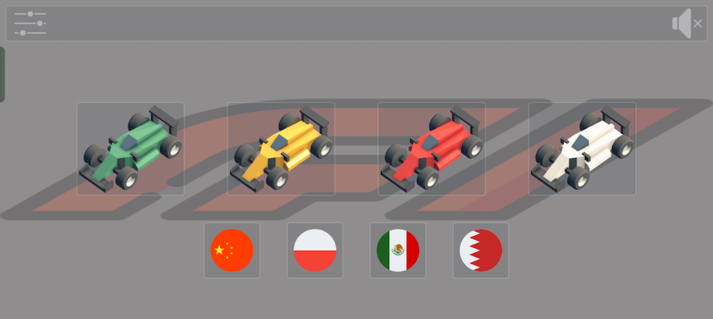
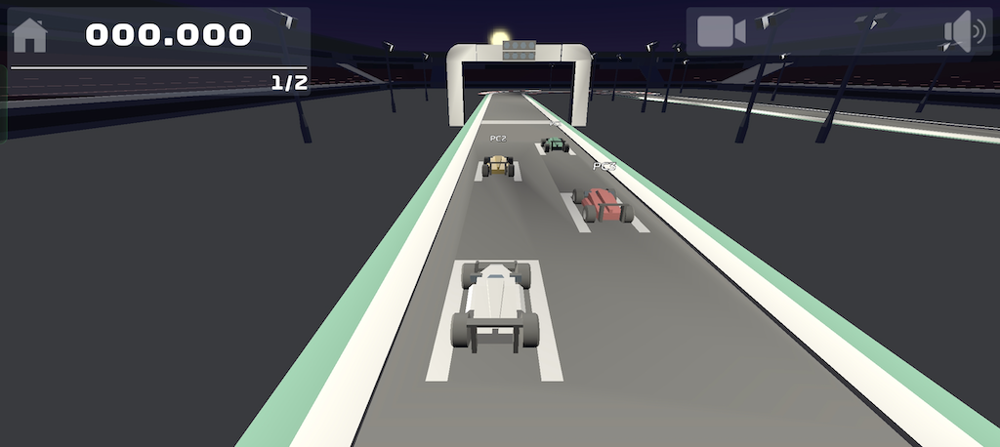
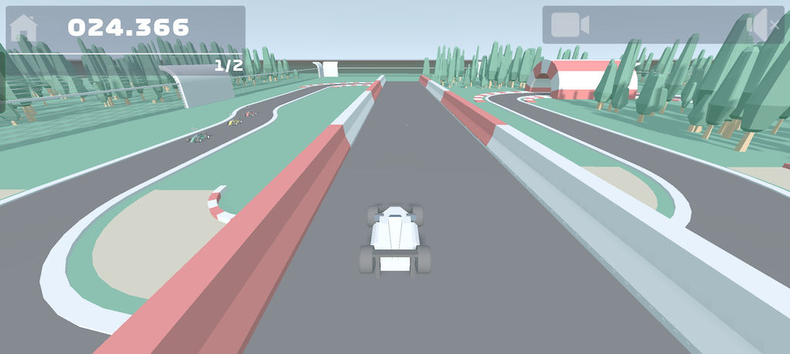

# F1
F1 is a car racing game made in [Godot](https://godotengine.org) v3.5. The idea was inspired by [Simple 2D car steering physics in games](https://engineeringdotnet.blogspot.com/2010/04/simple-2d-car-physics-in-games.html) blog post, but also by multiple articles on [Godot Recipes](https://kidscancode.org/godot_recipes/3.x/) website:
- 3D Kinematic Car
- Car steering
- Context-based steering

### Screenshots

### Credits
But I could not create this game without great free assets.
- Game assets (like models, materials) downloaded from [https://kenney.nl](https://kenney.nl).
- UI stuff (free icons, buttons, etc.) downloaded from [https://www.flaticon.com](https://www.flaticon.com).
- Audio assets (sounds) are from [https://pixabay.com/](https://pixabay.com/)

The F1 logo and fonts are trademarks of Formula One Licensing BV, a Formula 1 company.

